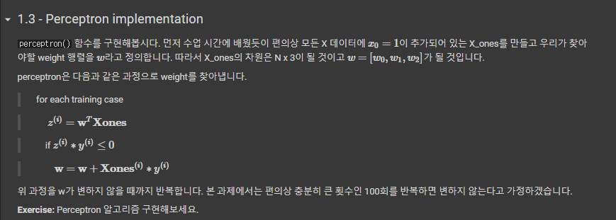
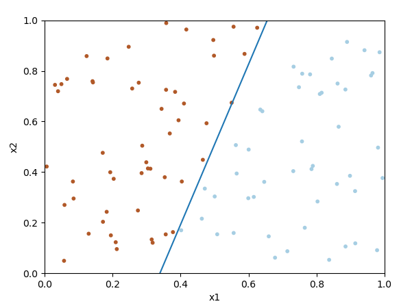

### Perceptron

- `Goal` 

    Perceptron을 이용해서 간단히 2차원의 Linearly seperable data를 classification하고 시각화해보자.
    
    *Linearly seperable : 직선으로 경계를 나눌 수 있다는 뜻 

 

- `Perceptron function`

prediction인 z와 target인 y의 곱이 음수 ? == 오답

 

`Result Graph`

