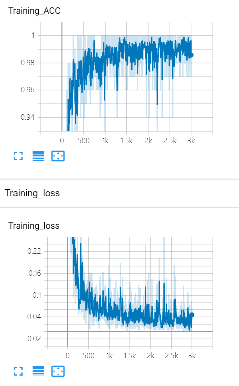

#### Tensor board 사용법 

- Get Module

       1. from torch.utils.tensorboard import SummaryWriter
       2. from tensorboardX import SummaryWriter 

- Terminal

      tensorboard --logdir runs

- Corab or Notebook

      %load_ext tensorboard
      %tensorboard --logdir "foldername" --port=6006

>