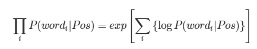
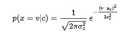

## Naive Bayes

Naive Bayes 분류는 지도학습의 일종이며, Feature와 Label를 Bayes 정리를 이용해서 분류하는 것이 특징이다.

단, 모든 feature가 서로 독립이어야 한다는 가정이 필요하다.
          
우리가 Naive Bayes로 할 것은 결국 다음 한 문장으로 정리할 수 있다.

      어떤 데이터 X가 주어졌을 때, 이 X가 어떤 클래스 C에 속할 확률은 얼마인가? (클래스 : 1, 2, ... C , ... N)
      
      즉, P(1|X), P(2|X), ...,  P(C|X), ... , P(N|X)를 비교한다.

      이후 결과적으로 가장 높은 확률을 갖는 클래스 C로 X를 분류하는 것이다. 

[Python numpy 구현 링크](https://ichi.pro/ko/guhyeon-eul-tonghan-hagseub-gaussian-naive-bayes-69330388386226)

[참고 링크](https://bkshin.tistory.com/entry/%EB%A8%B8%EC%8B%A0%EB%9F%AC%EB%8B%9D-1%EB%82%98%EC%9D%B4%EB%B8%8C-%EB%B2%A0%EC%9D%B4%EC%A6%88-%EB%B6%84%EB%A5%98-Naive-Bayes-Classification)          

---

 

#### Naive Bayes Flow 

Naive Bayes의 Flow는 다음의 2가지로 생각할 수 있다.
        
        학습 과정 : 사전확률과 우도를 모두 구해놓는 과정
        추론 과정 : 사전확률과 우도를 곱하고 비교해서 큰 쪽의 범주를 할당 

 

#### 예시 

간단하게 Naive Bayes의 Flow를 이해하기 위해 2개의 범주로 분류하는 문제를 생각해보자.

어떤 문서 **d** 가 주어졌을 때, 이 문서가 c1에 속할지 c2에 속할지 분류하는 문제이다.

베이즈 정리를 써보면 다음과 같다. 

    1. 문서 **d**가 c1 클래스에 속할 확률 P(c1|d)  = ( P(d|c1) x P(c1) ) / P(d)
    2. 문서 **d**가 c2 클래스에 속할 확률 P(c2|d)  = ( P(d|c2) x P(c2) ) / P(d)

    P(c1), P(c2)     : 사전확률  --- 해당 범주 내의 문서 개수 / 전체 문서 개수 
    P(d)             : 사전확률  
    P(c1|d), P(c2|d) : 사후확률  --- 문서 d가 주어졌을 때, 해당하는 클래스 범주에 속할 확률 (we want this!) 
    P(d|c1), P(d|c2) : 우도      -- 해당 범주 ci내에 속하는 d의 개수 (보통 알고 있다)  

 

베이즈 모델은 1번과 2번을 비교해서 더 큰 확률을 갖는 쪽으로 범주를 할당한다. 

    비교하는 과정에서 P(d)가 겹치므로 생략해도 무관하다 !!

따라서 다음과 같이 식을 다시 쓸 수 있다. 

    P(c1|d) = ( P(d|c1) x P(c1) ) / P(d) --> P(c1|d) =  P(d|c1) x P(c1)
    
    + 만 ~ 약 사전확률 P(c1), P(c2)도 같다면 마찬가지로 생략가능하다.

 

#### 예시 with feature 

먄약 문서 d가 feature w1, w2로 구성되어 있다고 하자.

우선 P(c1|d) = P(c1 | w1, w2)로 바꿔쓸 수 있다.

여기서 Naive Bayes는 모든 feature가 서로 독립임을 가정하기 때문에 다음의 수식이 가능하다.

        P(c1 | w1, w2) = P(w1, w2 | c1) x P(c1) = { P(w1 | c1) x P(w2 | c1) } x P(c1)

---

 

#### Naive Bayes in Python - 평활화 , 로그 우도 

바로 위에서 쓴 수식을 다시 써보자.

    P(c1 | w1, w2) = P(w1, w2 | c1) x P(c1) = { P(w1 | c1) x P(w2 | c1) } x P(c1)

**우도**에 대해서 이야기하고 싶다.

위 수식에서 볼 수 있 듯, 우도는 범주가 주어졌을 때, 각 feature가 나타날 확률이다.

    주목할 점은 우도를 각 feature가 나타날 확률을 연쇄적으로 곱해서 나타낼 수 있다는 것이다.

 

**주목할 점이 이제 주의할 점이 된다!**

만일 P(w1 | c1) = 1, P(w2 | c1) = 0 인 경우.. 즉, 해당 범주 c1에 2번 째 feature w2가 나타나지 않았을 경우에는??

    이 때 우도는 1 x 0 = 0 ... 0이 되어버린다. 

반대의 경우도 살펴보자.

각 feature는 서로 독립이라 하였으므로 만일 P(w1 | c2) = 0, P(w2 | c2) = 1 일 것이다.

    이 때 우도는 또한 0 x 1 = 0 이 된다!

 

우리는 두 범주에 해당하는 우도와 사전확률을 곱해서, 비교하여 값을 도출해야 한다.

하지만 값이 모두 0이 되어버려 비교가 불가능하게 되었다! 

    문제는 우도 값 가운데 0이 되는 값이 존재하기 때문이다..

---

 

#### 평활화(smoothing)

위의 문제를 해결하기 위해 우도 값이 0이 되지 않도록 보정하는 평활화 기법을 사용한다. 

Python으로 구현할 때에, i 번 째 feature가 해당 범주에 속하지 않더라도 그 **우도 값이 0이 되지 않게 해야한다.**

        따라서 분자와 분모에 적당히 작은 상수를 더해준다!

---

 

#### Log 우도 합

컴퓨터는 0에 가까운 부동소수점을 제대로 처리하지 못한다.

    따라서 우도의 곱은 로그 우도 합으로 처리한다.

Exponential과 지수에 있는 Log는 서로 상쇄되므로 양 변은 같은 식이다.  

---

 

#### Gaussain Naive Bayes

**연속적인 값의 데이터를 처리할 때, 각 클래스의 값들이 가우스 분포를 따른다고 가정한다.**

예를 들어보자. 

        Training data는 연속적인 속성 x에 대한 데이터이다.
        
        먼저 클래스에 따라 데이터를 나누고, 각 클래스에 속하는 x들의 평균과 분산을 계산한다.

        클래스 C와 관련된 x의 평균을 mean_c, 분산을 sigma^2_c 라고 하면
        
        주어진 클래스의 x 값들의 확률 분포가 정규분포로 표현된다.
 

여기서 x = v는 x가 여러 feature 중 v에 해당할 때를 이야기 하는 것이다.

**즉, 범주 C에 해당할 때, 해당 범주에 feature v가 존재할 확률을 확률 분포로써 나타낸 것을 의미한다.** 

