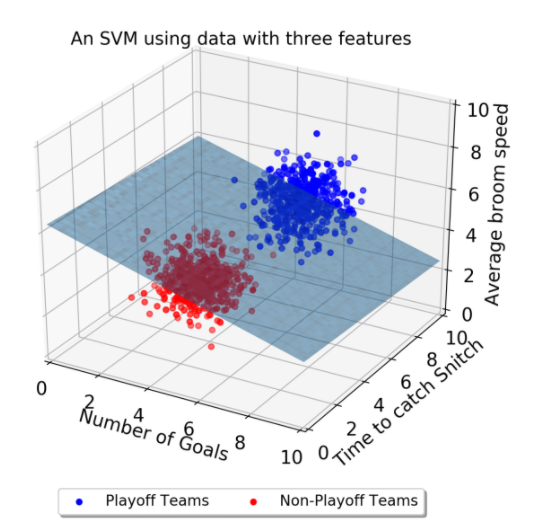
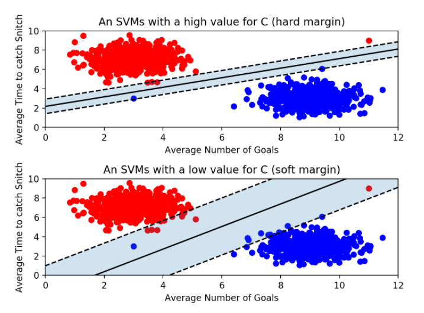
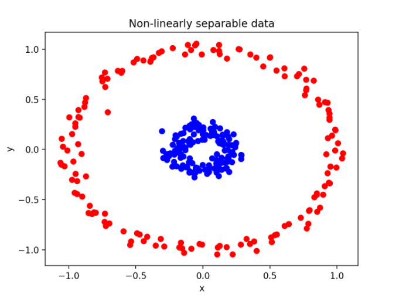
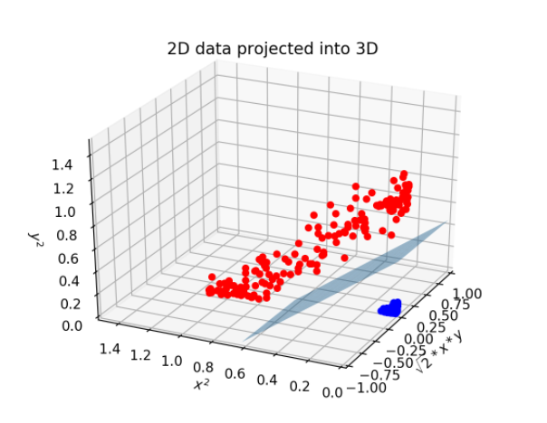
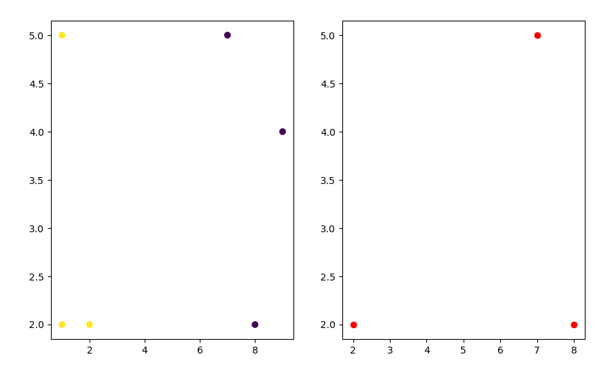

### SVM 

[참고 블로그](https://hleecaster.com/ml-svm-concept/)  
[참고 블로그2](http://jaejunyoo.blogspot.com/2018/01/support-vector-machine-1.html)

`분류에 사용할 수 있는 강력한 모델`

- Check list

      1. Decision Boundary , Margin , Outliar
      3. Kernel

#### Decision Boundary  & Margin

결정 경계는 데이터를 나눠주는 경계를 의미한다.

    2차원 데이터라면 경계선, 3차원이라면 경계면, 그 이상은 경계 초평면이다.

 

데이터의 분류의 완성도는 Margin으로 결정된다.

`Margin`은 결정 경계와 서포트 벡터들 사이의 거리를 의미한다.

    각 경계로부터 데이터들이 최대 Margin을 가지게 하면 된다.

    Outliar를 얼마나 허용할 것 인가에 따라 Hard / Soft 로 나눈다.

SVM은 다른 머신러닝 모델과는 다르게, 알맞은 서포트 벡터들만 골라내면 되기 때문에 매우 빠르다.

 

#### Kernel

`SVM은 선형으로 분리할 수 없는 데이터들을 분류하기 위해 Kernel을 사용한다.`

Kernel은 원래 가지고 있는 데이터들을 더 높은 차원의 데이터로 변경한다.

    2차원 데이터를 다항식 Kernel은 3차원으로, RBF 커널은 무한한 차원으로 확장시킨다.

      ex) (x1, x2) -> (x1', x2', x3')

 

`결정선으로 분류하지 못한 것을 결정면으로 분류`

#### Test

