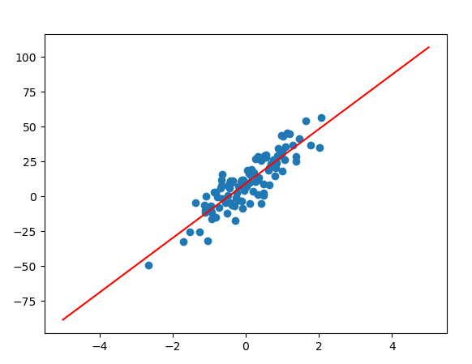

#### Linear Regression

Supervised learning의 시초

    X, y를 모두 주고, 해당 데이터를 가장 잘 설명하는 직선을 찾는 것이 목표

1. Linear Regression
2. Multi Class Linear Regression

Linear Regression 

 

`위 데이터에 대한 최적의 직선`

 

Multi Class Linear Regression

`Result`

