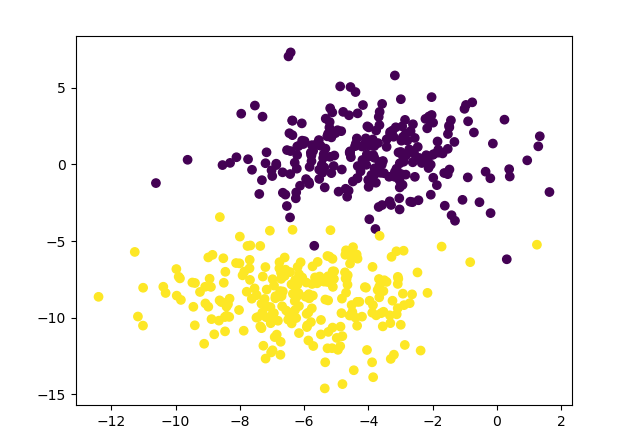
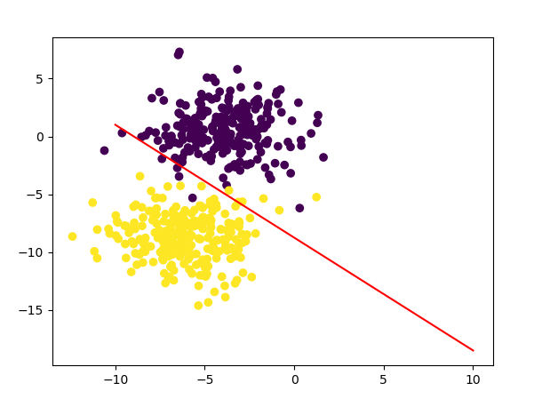
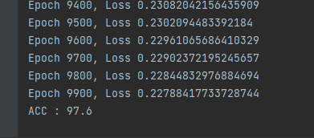
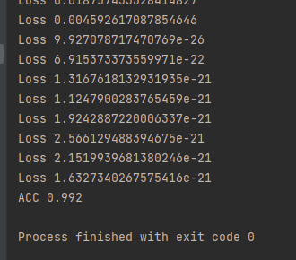

#### Logistic Regression

- Loss List
    
1. Normal Gradient Descent 
2. SGD
3. Hinge Loss 

 

- Logistic Regression with Normal Gradient Descent 

`Target Datas`

 

`Classification result`

 

`Loss & ACC`

 

- Hinge Loss 

