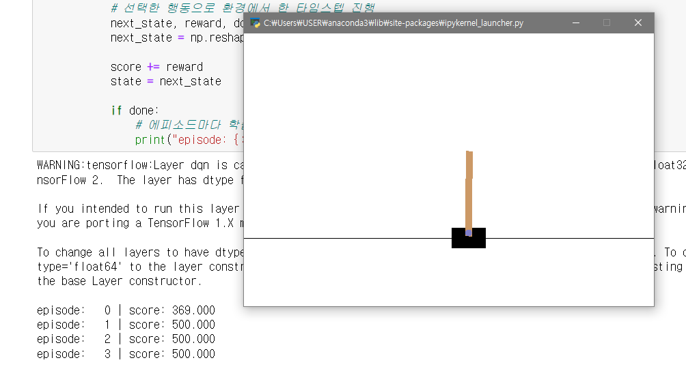

#### Machine Learning Based Reinforcement Learning 

- Intro

      기존의 Q-Learning과 Sarsa로 수행했던 MDP 모델 해결은 모두 Tabular 형식이었다.
      하지만 실제로 사용하는 MDP의 환경들을 Tabular form으로 처리하기에는 메모리 문제가 닿아있다.

      따라서 Machine Learning 또는 Deep Learning을 Base로 하는 접근 방법이 등장했다.

---

#### Function Approximation

- MDP의 해

        1. 최적의 Policy를 찾는 다는 것 
        2. 모든 State에서의 Value / Q value를 찾는 것

이를 Machine Learning Base로 찾는 방법은 다음과 같다.

        V(s)를 가장 잘 근사하는 V(s, w)를 찾는 것

        여기서 w는 Weight이며 최적의 Weight를 찾는 것이 바로 function을 근사하는 방법이다.

 

- Function Approximation 

        1. State Value function Approximation
        2. Action Value function Approximation

        with Tunable Parameter 'W' 

- Function Approximation 방법

        1. Linear Combinations of Features 
            - Linear Regresssion
            - Logistic Regression

        2. Neural Network
        3. Decision Tree
        4. Fourier / Wavelet Bases 
        
        ...

여기서 우리는 Differenctiable한 function Approximator를 사용할 것이다. (1번, 2번 )

        Gradient Descent Method를 사용하여 Weight를 최적화시키기 위해 !

        

    

