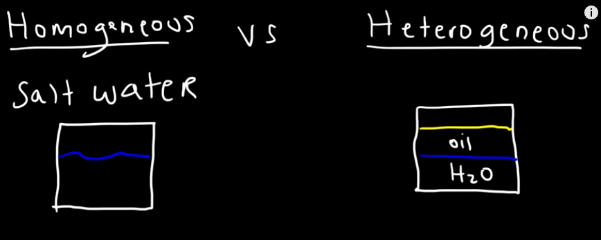

## `Homogeneous and Heterogeneous`

---

 

`Homogeneous vs Heterogenous in reinforcement learning`

        Multi Agent 를 다룰 때, 각 Agent의 역할이 뚜렷이 구별되거나, 그렇지 않을 때를 말하는 것 같다.

참고하면 원활히 이해 가능 : [relate paper](https://arxiv.org/abs/2010.02663)

---
 

`Homogeneous vs Heterogenous in chemical mixture`

`Homogeneous`

        It has Visually Undistinguishable parts
        Homogeneous mixture has a uniform composition (This is exist same in everywhere in mixture)

        It has one clear solution 

`Heterogeneous`

        It has multiple distinguishable parts
        Heterogeneous mixture isn't a uniform composition (Composition is vary by position)

