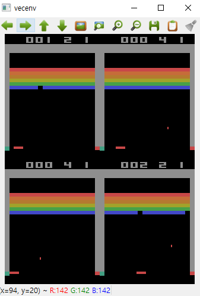

### Atari Env Setting & Simulation

- `Project Goal`

        #1) Atari Game 학습 환경 구축
        #2) Atari Game 학습 with DQN_CNN

<br>
<br>


- `Environment Setting`

` #1 Anaconda`

```commandline

conda create -n atari_env

conda install pytorch torchvision torchaudio cpuonly -c pytorch

conda install -c conda-forge gym

conda install -c conda-forge stable-baseline3

conda install -c conda-forge atari_py

conda install -c conda-forget opencv

```

<br>

` #2 ROMS Download`

[LINK : ROMS](http://www.atarimania.com/rom_collection_archive_atari_2600_roms.html)

    1. ROMS 압축 해제 
    2. ROMS 압축 해제
    3. Anaconda CMD : python -m atari_py.import_roms <Roms Path>


<br>

- `Atari Test Code`

```python

from stable_baselines3.common.env_util import make_atari_env
from stable_baselines3.common.vec_env import VecFrameStack
from stable_baselines3 import A2C

# There already exists an environment generator
# that will make and wrap atari environments correctly.
# Here we are also multi-worker training (n_envs=4 => 4 environments)
env = make_atari_env('Breakout-v0', n_envs=4, seed=0)
# Frame-stacking with 4 frames
env = VecFrameStack(env, n_stack=4)

model = A2C('CnnPolicy', env, verbose=1)
model.learn(total_timesteps=25000)

obs = env.reset()
while True:
    action, _states = model.predict(obs)
    obs, rewards, dones, info = env.step(action)
    env.render()


```

<br>

<div align="center">

`Breakout - V0 Simulation`



</div>

<br>

[참고 링크](https://ropiens.tistory.com/153)


        