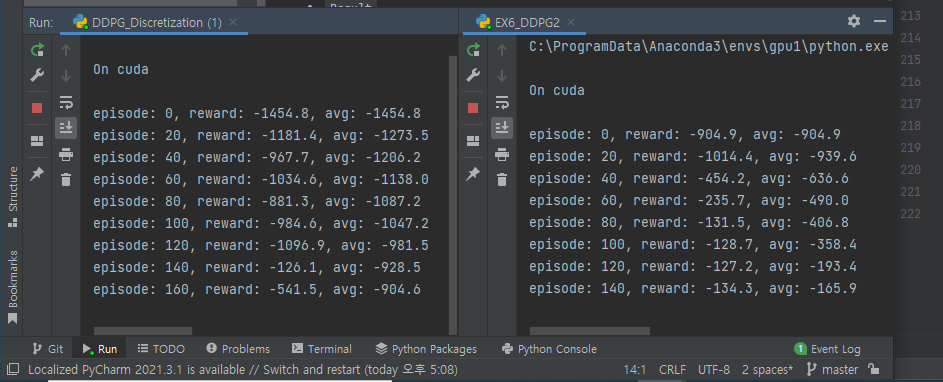

### Action Space 이산화

- `Goal : Bi-Pedel의 연속 행동 공간을 이산 행동 공간으로 양자화하여 학습 시켜보자.`

       # 1)
       1개의 연속적인 Action Space를 갖는 예제인 Pendulum으로 양자화의 성능을 확인해본다.

       # 2)
       BiPedal Example을 DQN으로 학습시키기 위해 연속적인 Action Space를 이산적인 공간으로 양자화해보자.
 
`기존의 연속 공간 Code`
```python
for episode in range(MAX_EPISODES):
    state = env.reset()
    done = False

    while not done: # Stacking Experiences

        action = mu(torch.from_numpy(state).float())        # Return action (-2 ~ 2 사이의 torque  ... )
        action = action.item() + ou_noise()[0]              # Action에 Noise를 추가해서 Exploration 기능 추가 ...
        next_state, reward, done, info = env.step([action])

        memory.put((state, action, reward / 100.0, next_state, done))
        score = score + reward

        state = next_state

        if memory.size() > 2000:
            for i in range(10):
                train(mu, mu_target, q, q_target, memory, q_optimizer, mu_optimizer)
                soft_update(mu, mu_target)
                soft_update(q, q_target)
```    

<br>

`이산 공간 Code`
```python
# Action Space Map
A = np.arange(-2, 2, 0.001)
for episode in range(MAX_EPISODES):
    s = env.reset()
    done = False
    score = 0.0

    while not done: # Stacking Experiences

        a = mu(torch.from_numpy(s).float()) # Return action (-2 ~ 2 사이의 torque  ... )

        # Discretize Action Space ...
        discrete_action = np.digitize(a.detach().numpy(), bins = A)

        # Soft Greedy
        sample = random.random()
        if sample < 0.1:
            random_action = np.array([random.randrange(0, len(A))])
            action = A[random_action - 1]

        else:
            action = A[discrete_action - 1]

        s_prime, r, done, info = env.step(action)

        memory.put((s, a, r / 100.0, s_prime, done))
        score = score + r
        s = s_prime

        if memory.size() > 2000:
            for i in range(10):
                train(mu, mu_target, q, q_target, memory, q_optimizer, mu_optimizer)
                soft_update(mu, mu_target)
                soft_update(q, q_target)
```    

<br>

- `Result`

<div align="center">



</div>

- `고찰`

      기존의 Noise를 추가하여 Exploration Property를 추가해주었던 것과 달리, 

      Soft greedy Policy를 사용하였기에 학습의 수렴 속도가 훨씬 느리다고 생각한다.

      하지만 본 프로젝트의 목표는 연속 상태 공간의 행동 데이터를 이산 공간으로 매핑하는 것이기 때문에

      DQN과 같은 이산공간에서 사용할 수 있는 조금 더 간단한 알고리즘으로 문제를 해결해볼 수 있게 되었다는 것이 중요하다.