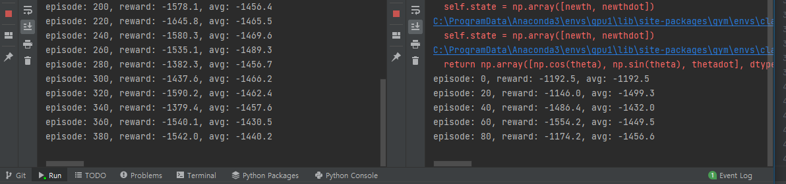

### Log

1. DDPG Model 이용
2. DQN Model 이용

### `2022 - 2 - 12`
Continoues한 Network의 Output을 Discrete하게 만들어 Memory에 저장함

        이 Discrete Action을 기반으로 Epiosde를 수행

Network의 Output을 Continuoues한 값으로 받았다.

하지만 이렇게 하면 코드 동작에는 문제가 없지만 학습이 되지 않았다.

### `2022 - 2 - 13`

Network의 Output 을 Category화 해서 학습시켜보자

즉, -2 ~ 2 사이의 출력값을 그대로 받아서 filter해서 쓰는 방법 대신
Categorical하게 받아서 이를 매핑해서 사용해보자

    더 Discrete한 값이 나와서 Simulation이 부자연 스러울 것

    이 부분이 얼추 동작이 된다면 Network를 깊게 만들어서 Output Class를 100개 정도로 나누어보자.

