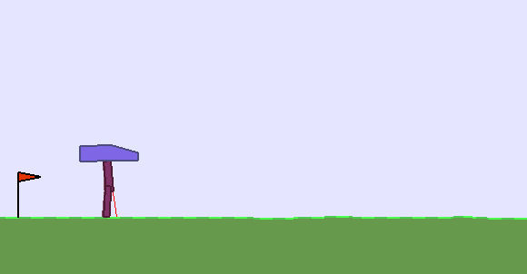
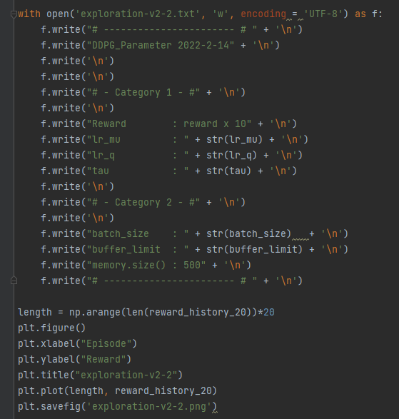
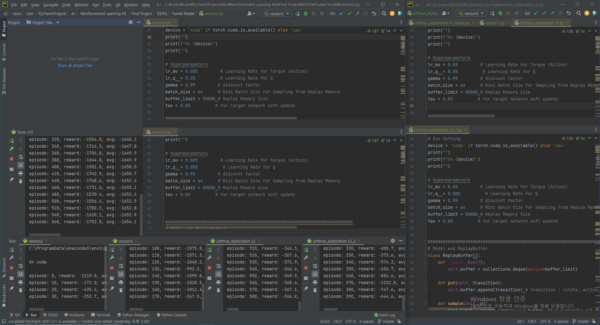
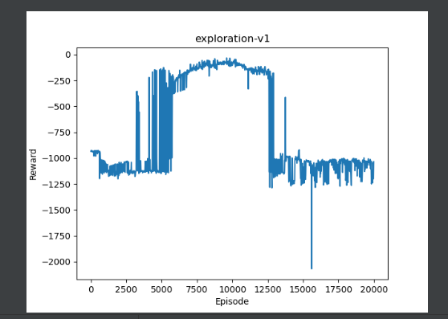
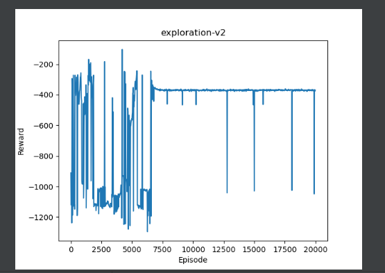

## `최적경로`

Input  : 사진   
Output : 모터 움직임 (상 하 좌 우) 

 

### `Task 1 : Space Discrization & Exploration Noise`

- `Goal 1)`

      연속 행동 공간에서 정의되는 문제를 이산 행동 공간 모델에 적용하여 문제 해결

 24 State (Continuous) + 4 Action(Continuous)

`Bi Pedal Walker-v3`

- `Goal 2)`

      Infinite Visitation Condition을 만족시키기 위해, Explotation과 Exploration 조건을 만족시켜야한다.
      기존 DDPG 알고리즘은 OrnsteinUhlenbeckNoise을 사용하지만 값이 크기 때문에 수렴 속도에 악영향을 미친다.
      따라서 다른 방법으로 Exploration 조건을 충족시켜본다.

      # 1)
      numpy의 digitize api를 통해 space 분해 
      
      Ex) -1 ~ 1 의 연속 데이터 -> [-1.0, -0.75, -0.5, ... ,0.5, 0.75, 1.0]
      
      # 2)
      앙상블 기법과 Q Value에 대한 Softmax 연산을 이용

      np.randomm.choice(action_list, p = softmax_distribution)

      을 통해 Action을 선택 -> Exploration Noise를 직접적으로 추가하는 대신
      SoftMax Policy Selection을 통해 Exploration 조건을 만족 시킬 수 있다.
      

 

- `Task 2 : Select Algorithm`

       # DQN  : Maximation Bias -> 수렴 속도가 매우 느림   
       # DDPG : 행동 공간의 이산화로 인한 알고리즘 복잡도 증가 + 하이퍼 파라미터 민감성 
       # TD3  : 행동 공간의 이산화로 인한 알고리즘 복잡도 증가 + 하이퍼 파라미터 민감성 

       수렴 속도가 느리더라도 bias없이 수렴할 수있도록 DDPG 또는 TD3로 선택
      
       혹은 D3QN

 

- `Task 3 : Hyperparameter Tunining`

 

`Hyperparamter에 따른 학습 ... (reward : 100배) `

`동일한 앙상블 모델 x 4`

`서로 다른 앙상블 모델 x 4`

