### Markov Decision Process

- List

1. MDP?
2. Policy
3. Value Functions & Bellman Expectation Eqn
4. Optimal Value function & Bellman Optimality Eqn

---

#### MDP?

Markov Decision Process는 MRP 모델에 Action을 추가한 모델이다.

    달라지는 것은 State Transtion probabiliy와 Reward Function이다.

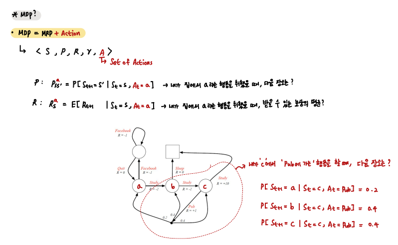

 

#### Policy

    Policy는 내가 State S에 있을 때, 특정 행동을 할 확률이다.

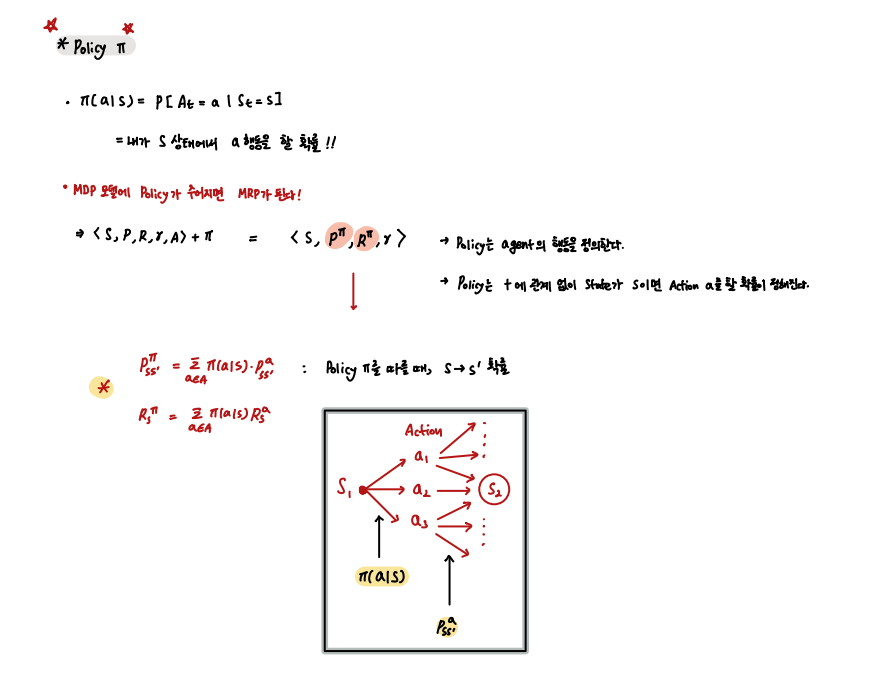

 

다음은 위 식의 증명이다.

    조건부 확률과 전확률 정리를 이용 

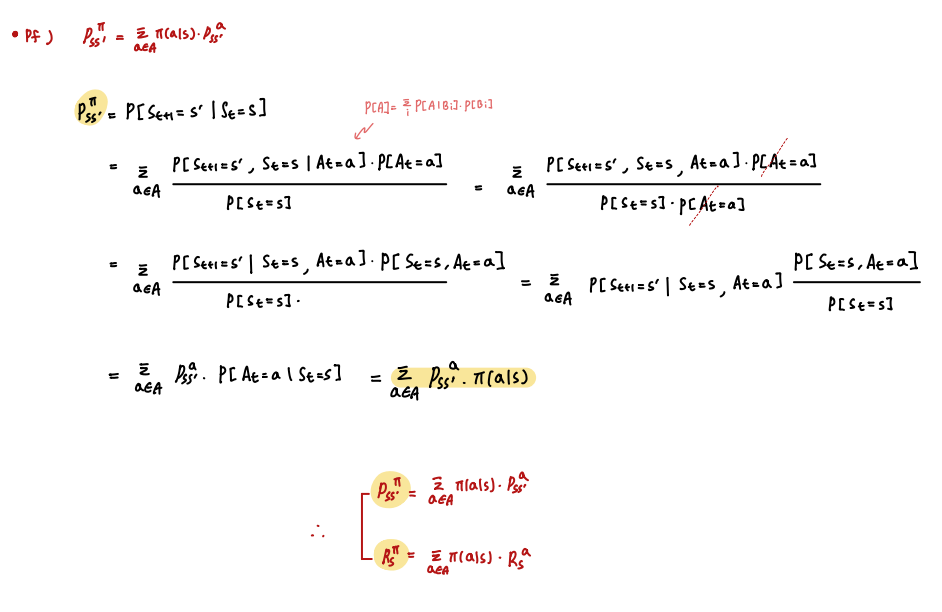

 

#### Value Functions & Bellman Expectation Eqn

- Value functions `(State Value function & Action value function)`

앞서 MRP에서 다루었던 Value function과 같다.

하지만 Action이 추가되었으므로, State S 에서 State S+1로 넘어가는 가운데에 한 Stage가 더 추가되었고, 

이 Stage에 대한 value인 `Action value function`이 추가된다. 

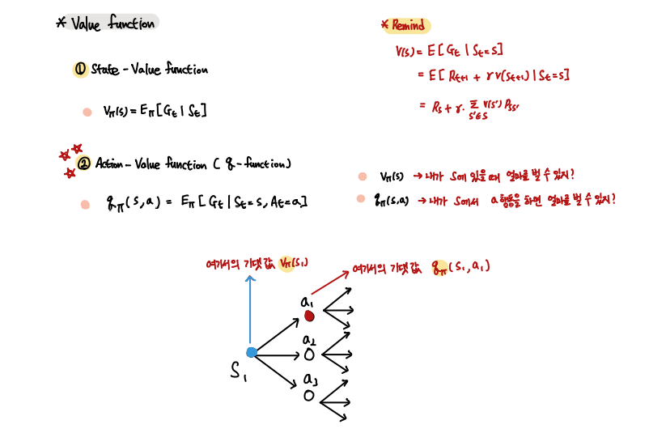

 

자칫 헷갈리기 쉬운데 다음 예를 통해 잘 이해할 수 있다.

    State value function은 내가 현재 State에서 벌 수 있는 돈
    
    Action value function은 내가 현재 State에서 어느 행동을 했을 때 벌 수 있는 돈

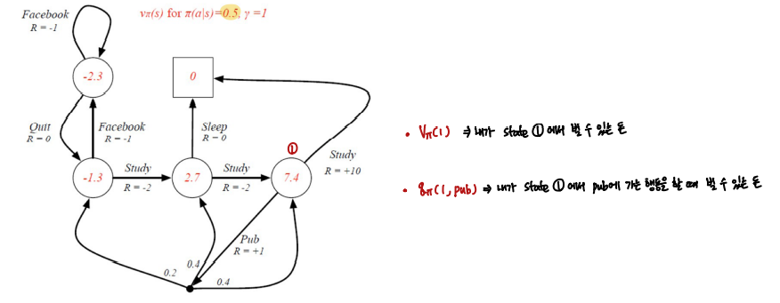

 

- Bellman Expectation Eqn

MDP + Policy는 MRP가 된다. 

따라서 MRP에서 유도한 Bellman Expectation Eqn과 동일한 과정으로 동일 형태로 유도할 수 있다.

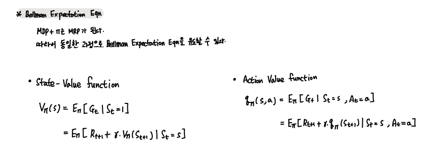

 

추가적으로 두 Function을 서로에 대해 표현할 수 있다.

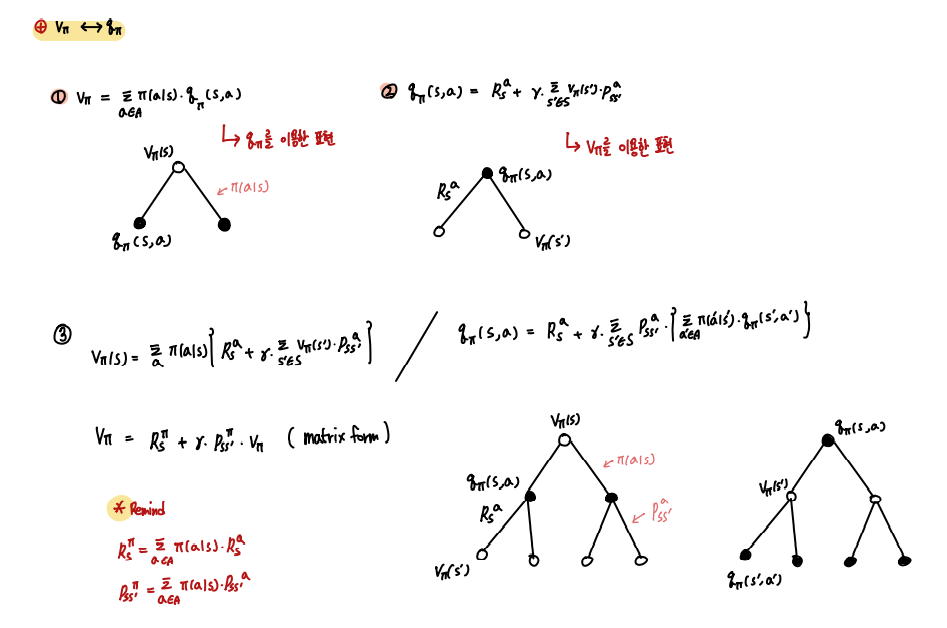

 

다음은 위 표현에 대한 증명이다.

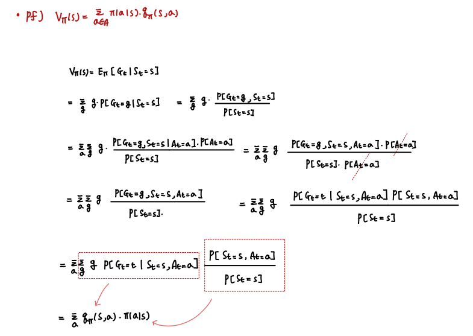

 

사용 예시

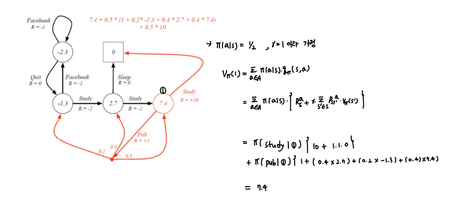

 

#### Optimal Value function & Bellman Optimality Eqn

- Optimal Policy

이제 최적의 Policy에 대해 살펴보자.

    어떤 Policy를 따랐을 때 가장 좋은 결과 , 가장 좋은 보상을 받을 수 있을까?

    모든 Policy 중에서 가장 돈을 많이 주는 Policy를 따르자!

최적의 Policy를 *로 표시한다.

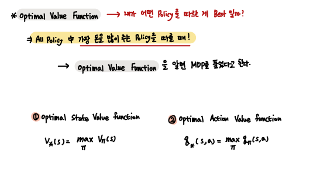

 

- Optimal Policy Theorem 

MDP는 항상 최적의 Policy를 가진다.

또한 해당 Policy를 따르는 state function들은 모두 최적의 값을 가진다. 

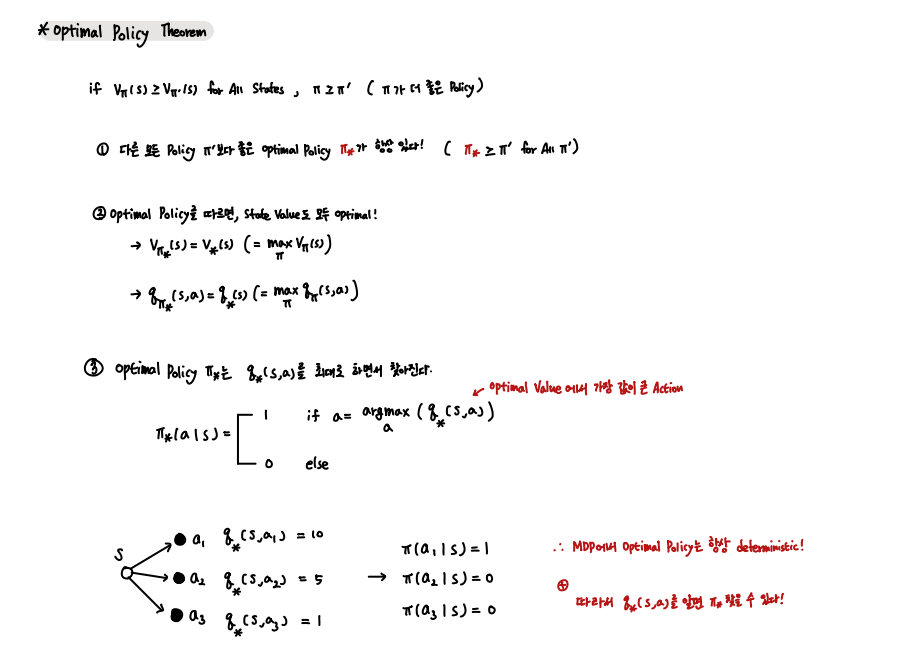

 

사용 예시

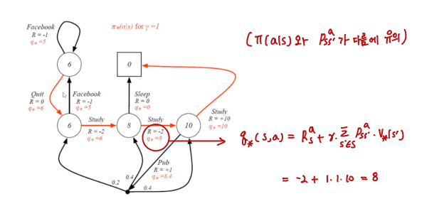

 

- Bellman Optimality Eqn 

Bellman Optimality Eqn은 다음과 같다. 

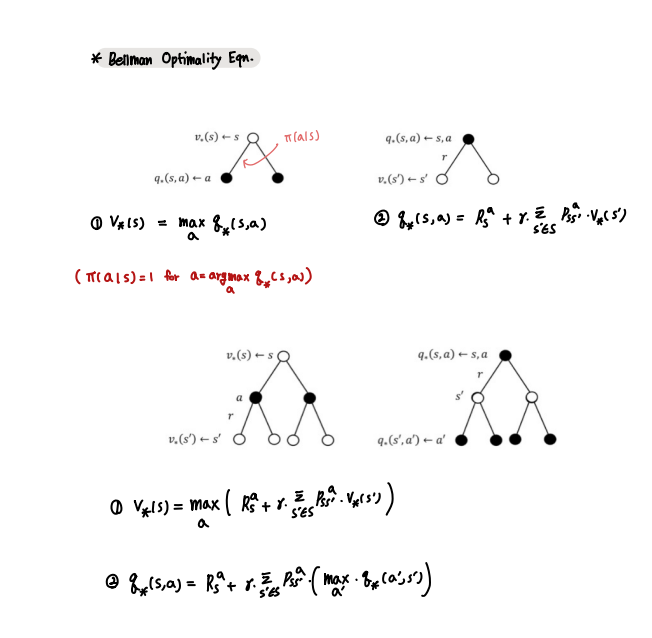

 

Bellman Optimality Eqn은 비선형 방정식이므로, 일반적인 방법으로 해를 구하기 어렵다.

따라서 다음과 같이 Iterative한 방법으로 해를 구한다.

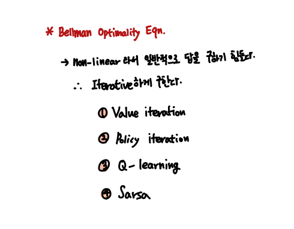

