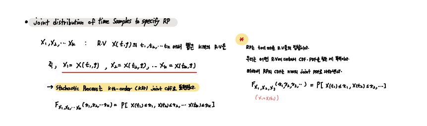
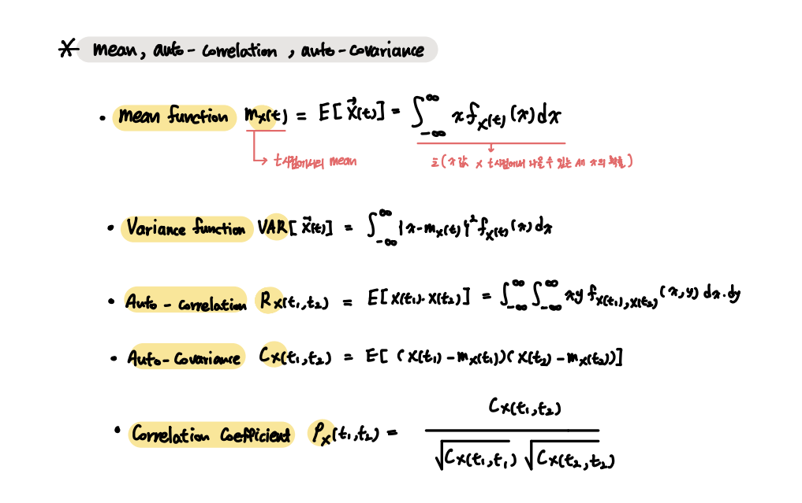
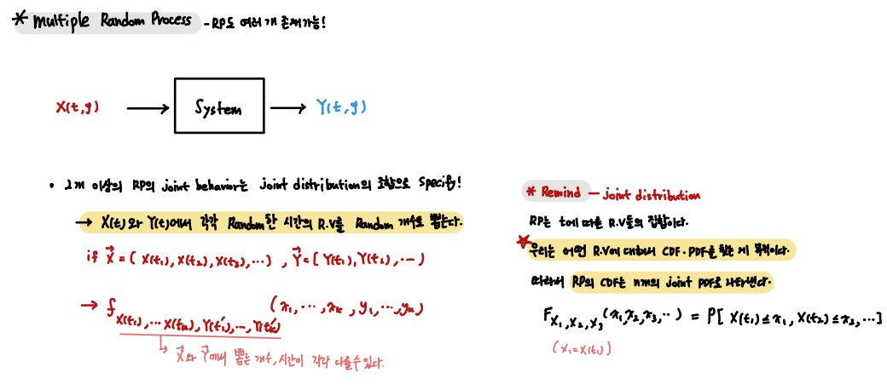
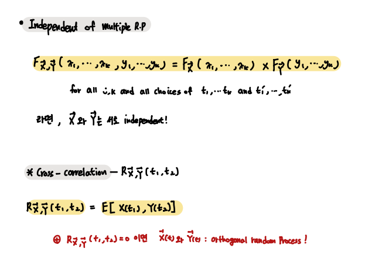

### Random Process

Random Process 

    Family of Random Variables indexed by time t --- : { X(t, outcome), t in I }

---

 

- Random Process

`Sample Space의 Outcome을 R.V가 이제 시간에 대한 함수로 매칭시킨다.`
`X(t , outcome)의 형태의 R.V를 가지며, 매 time step이 모두 R.V이다.`

        EX) t = 1 일 때, X1 = X(t1, outcome)

 

- Stochastic Process의 Joint CDF 표현

    Random Process는 time index를 가진 Random Variable의 집합이다.
    
    우리는 결국 Random Variable의 CDF와 PDF를 찾고 싶다.
    
    따라서 이렇게 많은 R.V를 가진 Random Process에 대해서는 다음과 같이 K차 Joint CDF를 정의한다.

 

 

`앞서 다룬 R.V의 평균, 분산, ... 이 모두 time t에 대한 함수로 변했을 뿐이다.`

 

- Multiple Random Process

당연히 Random Process도 여러 개가 있을 수 있다.

이 여러 개의 Random Process를 다루는 방법 또한 있다. 

    2개 이상의 Random Process의 행동은 Joint distribution의 조합으로 구체화시킨다.

Random Process X(t)와 Y(t) 각각에서 Random time에서 Random Variable을 뽑아서 만들 수 있다. 

 

Multiple Random Process의 Independent 또한 위와 같은 방법으로,

가능한 모든 Pair에 대해서 위 조건이 만족되면 Random Process X(t)와 Y(t)는 독립이다.

