### Markov Process & Markov Reward Process

- List

1. Markov Random Process & Markov Property
2. Markov Reward Process
3. State Value function & Bellman Eqn

 

---

궁극적으로는 Markov Decision Process를 다룰 것이므로 간단하게 알아보고 기본을 다지자.

- `Markov Decision Process`

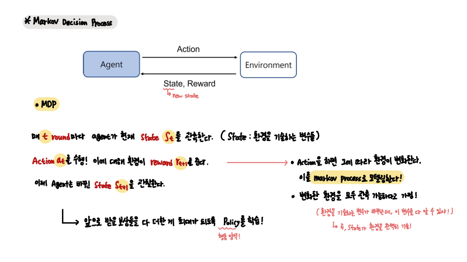

Markov Decision Process는 일반적으로 강화학습을 위한 환경을 묘사해준다. 

즉, Agent가 어떠한 행동을 하면 그에 따라 환경이 바뀌는데, 이 환경을 Markov Process로 묘사할 수 있다.

여기서 우리는 환경이 `fully observable`하다고 가정한다.

        즉, Action에 따라 바뀌는 환경이 모두 관측가능하다는 것이다.

        State는 환경을 완벽히 기술하는 변수들인데, 환경이 변화하면 이 변수들이 변화한다.

        따라서 환경이 모두 관측가능하다 라는 말은, 이 변수들을 모두 알 수 있다는 말이다.

 

이에 앞서 Markov Process와 Markov Reward Process를 알아야햔다.

 

---

- `Markov Random Process`

먼저 Markov 성질에 대해서 알아야한다.

어떤 R.P X(t)가 있을 때, R.V X(t+1)의 값이 현재에만 의존할 때, Markov 성질을 따른다고 한다.

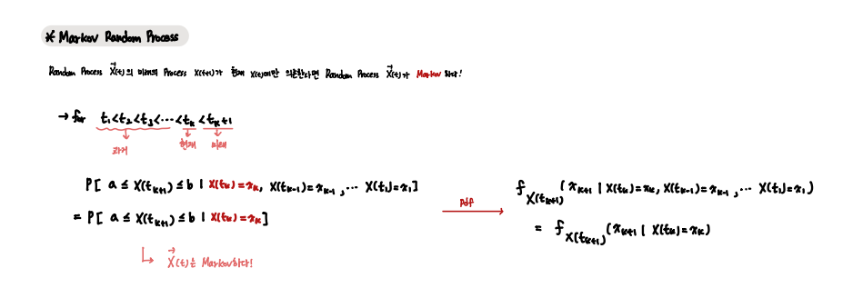

MDP도 이 Markov 성질을 따르는데 현재의 값 X(t)에 과거 정보들이 다 담겨있다고 가정한다. 

 

- Markov Property & State Transition probability 

`MDP의 State 들은 모두 Markov 하다.`

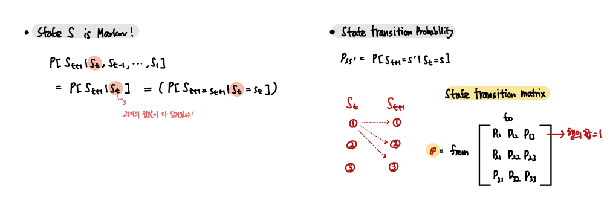

또한 P[St+1 | St]의 확률을 matrix형태로 만들어 쉽게 다룰 수 있다.  

 

- Markov Process

`Markov Process = <S, P>`

Markov Chain이라고도 하며 Random State Sequence + State Transition matrix로 구성되는 모델이다.

여기서 Random State Sequence는 Episode들을 구성한다.

    EX) C1 -> C2 -> C3 -> Pass -> Sleep

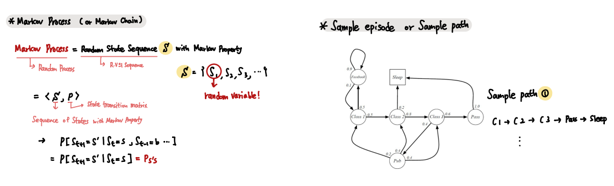

 

- Markov Reward Process

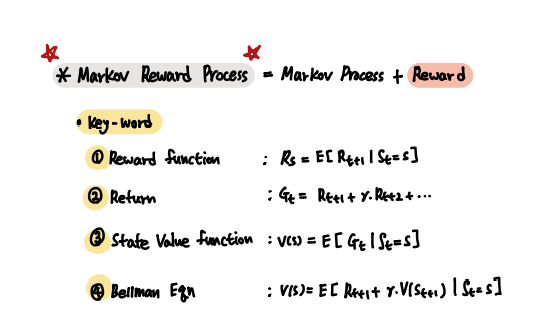

Markov Reward Process는 Markov Chain에 보상을 더한 모델이다.

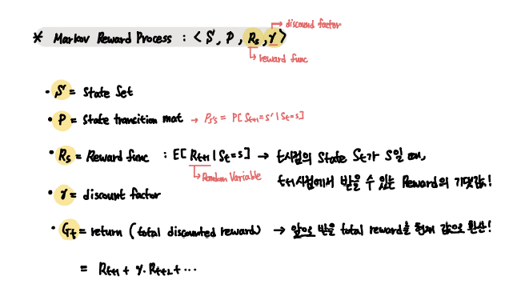

 

이 모델에서는 추가적으로 State Value function이라는 것을 정의하는데 매우매우 중요하다.

`State Value Function`

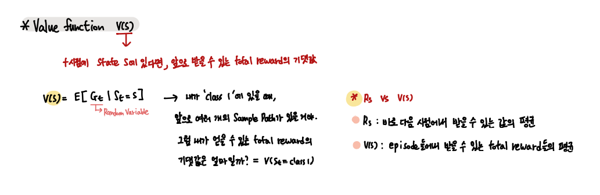

    이 State Value function Set을 얻는데에는 Bellman Eqn이 필요하다.

 

`Bellman Eqn for State value function`

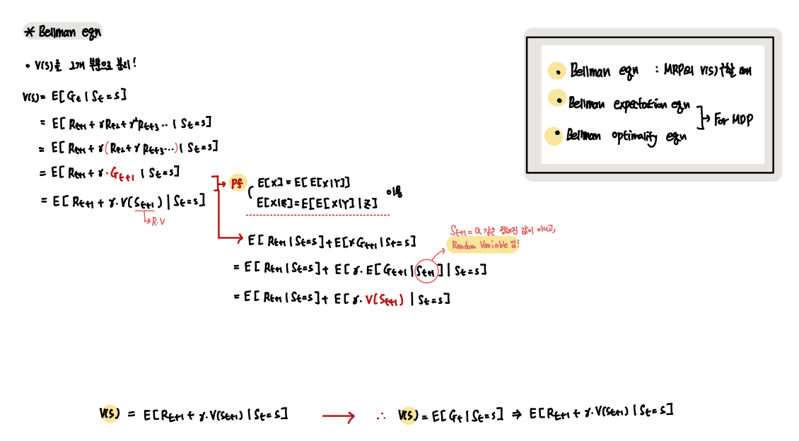

Bellman Eqn을 이용해서 얻은 식을 조금 더 변형해보자.

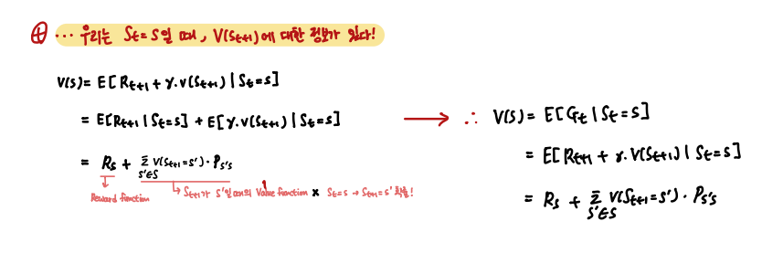

위 식을 이용해서 간단하게 Class3 state의 V(3)을 구해보자

    이 식들을 주목해보니 Matrix 형태로 만들 수 있다!

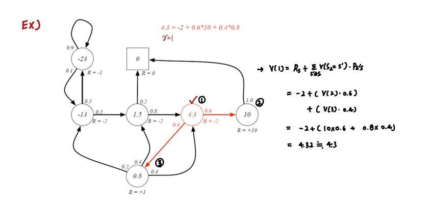

 

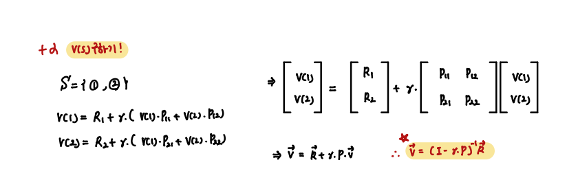

위 행렬 방정식을 이용해서 우리는 전체 모델의 state value function을 구할 수 있다.

    필요한 것은 각 State의 Reward function과 State Transition Matrix 뿐이다!

