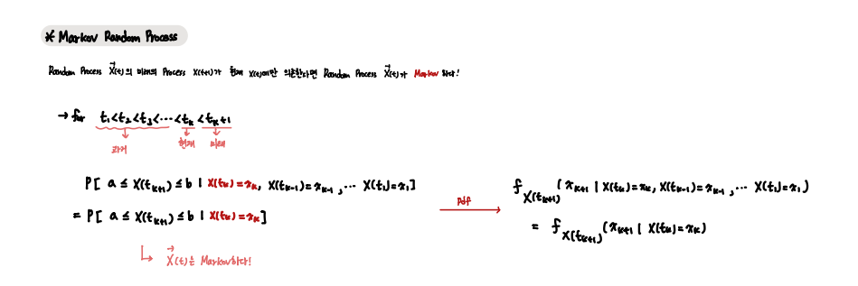

### Markov Decision Process

Reinforcement learning을 위한 시작으로 MDP를 알아본다.

---

- `Markov Random Process`

먼저 Markov 성질에 대해서 알아야한다.

어떤 R.P X(t)가 있을 때, R.V X(t+1)의 값이 현재에만 의존할 때, Markov 성질을 따른다고 한다.

즉, 다음과 같다. 

MDP도 이 Markov 성질을 따르는데 현재의 값 X(t)에 과거 정보들이 다 담겨있다고 가정한다. 

 

- `Markov Decision Process`

Markov Decision Process는 일반적으로 강화학습을 위한 환경을 묘사해준다. 

즉, Agent가 어떠한 행동을 하면 그에 따라 환경이 바뀌는데, 이 환경을 Markov Process로 묘사할 수 있다.

여기서 우리는 환경이 `fully observable`하다고 가정한다.

        즉, Action에 따라 바뀌는 환경이 모두 관측가능하다는 것이다.

        State는 환경을 완벽히 기술하는 변수들인데, 환경이 변화하면 이 변수들이 변화한다.

        따라서 환경이 모두 관측가능하다 라는 말은, 이 변수들을 모두 알 수 있다는 말이다.

 

- Markov Property & State Transition probability 

`MDP의 State 들은 모두 Markov 하다.`

또한 P[S t+1 | S t]의 확률을 matrix형태로 만들어 쉽게 다룰 수 있다. 

