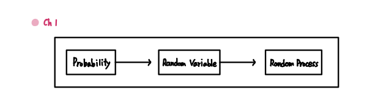
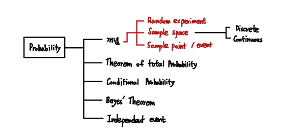
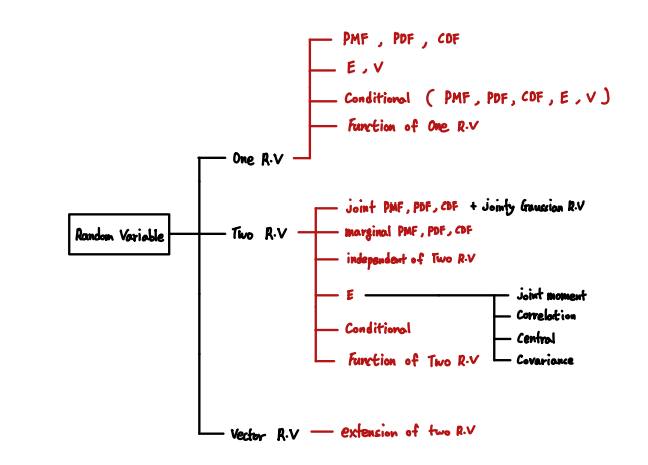
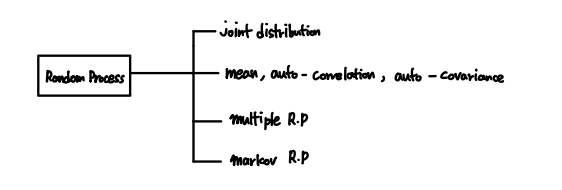
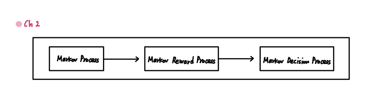
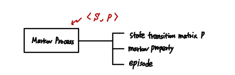
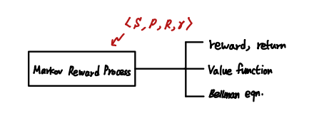
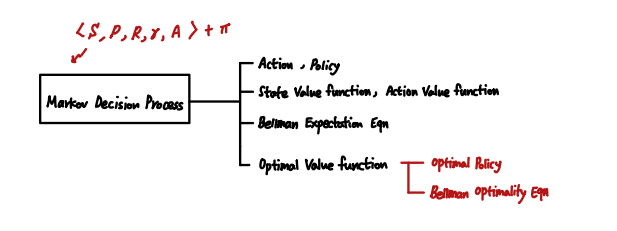
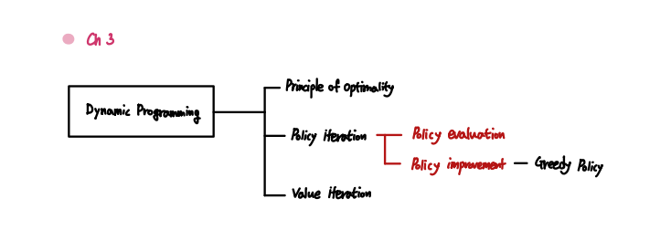

#### Ch 01

 

`Probability` 

`Random Variable`

`Random Process`

 

#### Ch 02

`Markov Process`

`Markov Reward Process`

`Markov Decision Process`

 

#### Ch 03

`Dynamic Programming`

 

#### Ch 04

`Model Free Approach`

