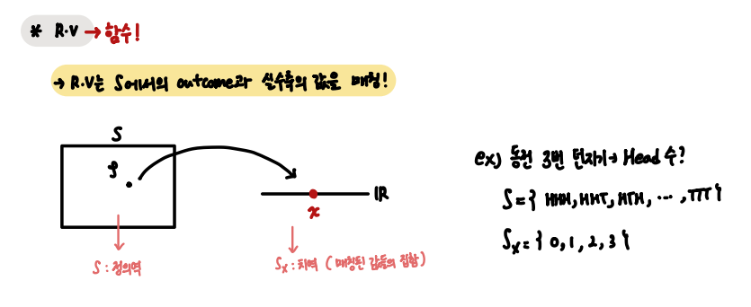

## Random Variable

 

- List

1. Random Variable
2. Two Random Variables
3. Vector Random Variables

 

Before Start 

`R.V는 Sample Space의 Outcome을 실수로 대응시키는 함수`

`Two R.V는 Sample Space의 Outcome을 (실수, 실수) 로 대응시키는 함수`

`Vector R.V는 Sample Space의 Outcome을 실수 집합으로 대응시키는 함수`

---

 

#### Random Variable

- Random Variable

`R.V == 함수`

 

`R.V로 매칭된 집합의 확률은 Equivalent Event의 확률로써 계산한다.`

 

`요약`

 

- Discrete Random Variable , PMF

Sample Space의 관측치를 이산적인 실수로 매칭시키는 R.V

 

- Discrete R.V의 평균, 분산

 

- Conditional PMF, 평균, 분산
- 

 

- CDF, PDF 

Discrete R.V , Continuous R.V 모두 적용 가능

 

- CDF, PDF의 평균, 분산

 

- Conditional CDF, PDF 

 

 

#### Two Random Variables 

- Two Random Variables

R.V가 Vector (x, y)로 값을 매칭 

 

- Joint PMF, Marginal PMF

 

- Joint CDF, Marginal CDF

 

- Joint PDF, Marginal PDF

 

 

- Jointly Gaussian R.V

 

- Independent of Two R.V

 

- Two R.V 함수의 평균, 분산

 

- Joint moment, Correlation , Covariance, Correlation Coefficient  

 

 

- Conditional Probability of Two R.V

 

 

- Conditional 평균 of Two R.V

 

- Two R.V의 함수

`Two R.V의 함수로부터 CDF, PDF를 찾는 방법` 

 

 

 

#### Vector Random Variable

`Two R.V의 확장`

- Vector R.V

 

 

 

