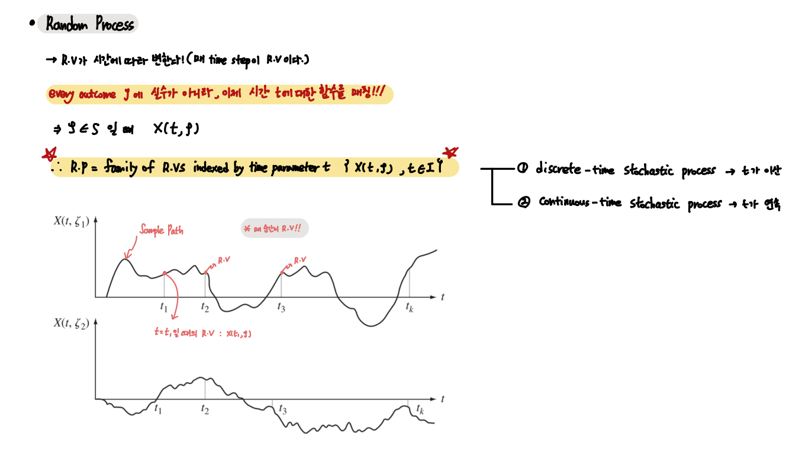
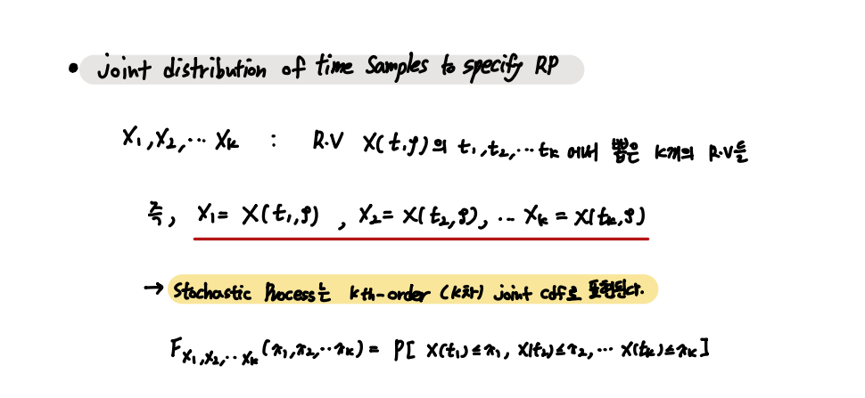

### Random Process

Random Process 

    Family of Random Variables indexed by time t --- : { X(t, outcome), t in I }

---

 

- Random Process

`Sample Space의 Outcome을 R.V가 이제 시간에 대한 함수로 매칭시킨다.`
`X(t , outcome)의 형태의 R.V를 가지며, 매 time step이 모두 R.V이다.`

        EX) t = 1 일 때, X1 = X(t1, outcome)

 

- Stochastic Process의 Joint CDF 표현

 

`앞서 다룬 R.V의 평균, 분산, ... 이 모두 time t에 대한 함수로 변했을 뿐이다.`

