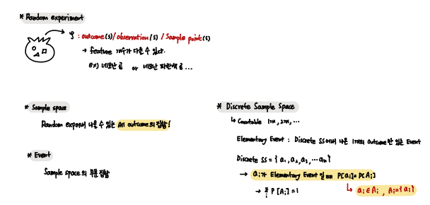
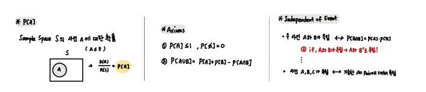
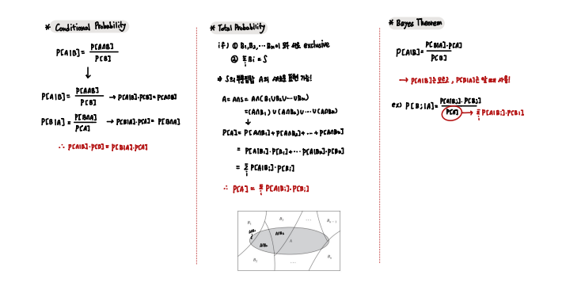

## Probability for Reinforcement learning

- Basic notation
    
       Random Experiment
       Sample Space / Event
       Basic Axioms
       Independent of Event
       Conditional Probability 
       Theorem of total Probability
       Bayes Theorem

 

- Random Experiment / Sample Space / Event

 
 
- Basic Axioms Independent of Event

 

- Conditional Probability / Theorem of total Probability / Bayes Theorem

`Bayes 정리와 전확률 정리는 이후 굉장히 자주 사용되니 잘 기억하고 이해하자.`

